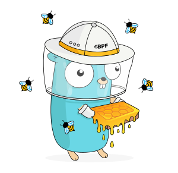

# gBPF

gbpf-go is a pure Go library that provides utilities for loading, compiling, and
debugging gBPF programs. It has minimal external dependencies and is intended to
be used in long running processes.

See [gbpf.io](https://gbpf.io) for complementary projects from the wider gBPF
ecosystem.

## Getting Started

Please take a look at our [Getting Started] guide.

[Contributions](https://gbpf-go.dev/contributing) are highly encouraged, as they highlight certain use cases of
gBPF and the library, and help shape the future of the project.

## Getting Help

The community actively monitors our [GitHub Discussions](https://github.com/khulnasoft/gbpf/discussions) page.
Please search for existing threads before starting a new one. Refrain from
opening issues on the bug tracker if you're just starting out or if you're not
sure if something is a bug in the library code.

Alternatively, [join](https://gbpf.io/slack) the
[#gbpf-go](https://khulnasoft.slack.com/messages/gbpf-go) channel on Slack if you
have other questions regarding the project. Note that this channel is ephemeral
and has its history erased past a certain point, which is less helpful for
others running into the same problem later.

## Packages

This library includes the following packages:

* [asm](https://pkg.go.dev/github.com/khulnasoft/gbpf/asm) contains a basic
  assembler, allowing you to write gBPF assembly instructions directly
  within your Go code. (You don't need to use this if you prefer to write your gBPF program in C.)
* [cmd/bpf2go](https://pkg.go.dev/github.com/khulnasoft/gbpf/cmd/bpf2go) allows
  compiling and embedding gBPF programs written in C within Go code. As well as
  compiling the C code, it auto-generates Go code for loading and manipulating
  the gBPF program and map objects.
* [link](https://pkg.go.dev/github.com/khulnasoft/gbpf/link) allows attaching gBPF
  to various hooks
* [perf](https://pkg.go.dev/github.com/khulnasoft/gbpf/perf) allows reading from a
  `PERF_EVENT_ARRAY`
* [ringbuf](https://pkg.go.dev/github.com/khulnasoft/gbpf/ringbuf) allows reading from a
  `BPF_MAP_TYPE_RINGBUF` map
* [features](https://pkg.go.dev/github.com/khulnasoft/gbpf/features) implements the equivalent
  of `bpftool feature probe` for discovering BPF-related kernel features using native Go.
* [rlimit](https://pkg.go.dev/github.com/khulnasoft/gbpf/rlimit) provides a convenient API to lift
  the `RLIMIT_MEMLOCK` constraint on kernels before 5.11.
* [btf](https://pkg.go.dev/github.com/khulnasoft/gbpf/btf) allows reading the BPF Type Format.

## Requirements

* A version of Go that is [supported by
  upstream](https://golang.org/doc/devel/release.html#policy)
* CI is run against kernel.org LTS releases. >= 4.4 should work but EOL'ed versions
  are not supported.

## License

MIT

### gBPF Gopher

The gBPF honeygopher is based on the Go gopher designed by Renee French.

[Getting Started]: https://gbpf-go.dev/guides/getting-started/
