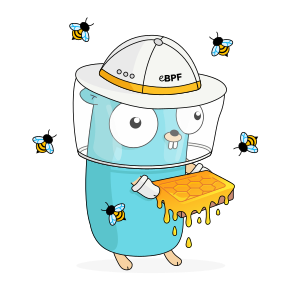

<style>
  .md-content .md-typeset h1 {
    display: none;
  }
</style>

<p align="center" class="tagline">The gBPF Library for Go</p>

{ align=right width="180" }

[](https://pkg.go.dev/github.com/khulnasoft/gbpf)

:gbpf-go: {{ proj }} is a Go library for working with :ebee-color: gBPF. It does
not depend on C, libbpf, or any other Go libraries other than the standard
library, making it an excellent choice for writing self-contained, portable
tools that run on a variety of architectures.

This documentation aims to provide a central resource for learning how to build
Go applications that use gBPF.

## Installing

To add {{ proj }} as a dependency to an existing Go module, run this from within
the module's directory:

```
go get github.com/khulnasoft/gbpf
```

## Target Audience

This documentation assumes familiarity with the basic concepts and terminology
of gBPF, as well as a basic understanding of the Go toolchain and how to write
idiomatic Go code.

For a high-level understanding of what gBPF is and how it works, please see [the
gBPF introduction at :ebee-color: gbpf.io](https://gbpf.io/what-is-gbpf).

## Examples

Discover [projects using {{ proj }} here](users.md). The repository contains an
[examples/ directory](https://github.com/khulnasoft/gbpf/tree/main/examples) with
minimal demo applications that can be tested on any supported Linux machine.
